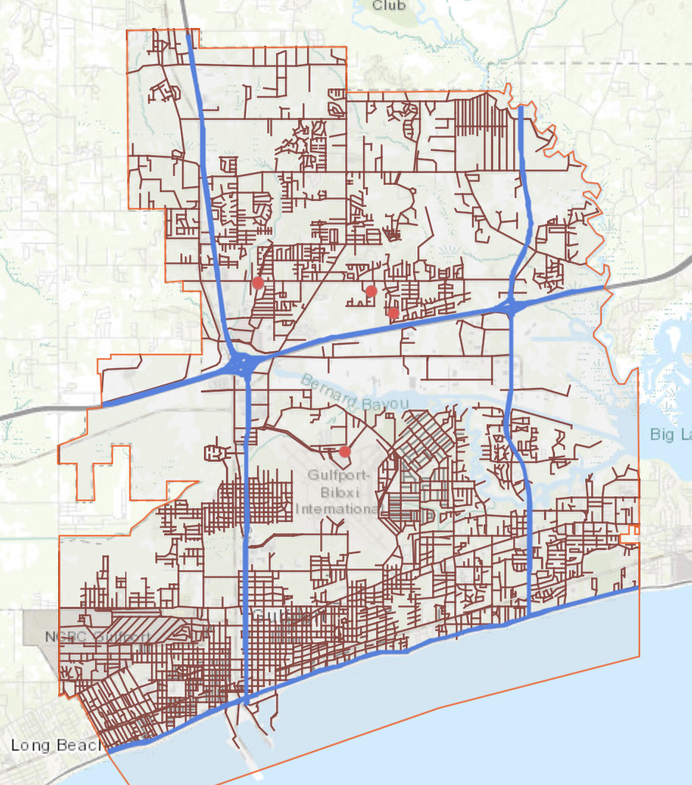

# TDR - Final Pass Walk Through Guide

## Table of Contents
1. [How to get the roads](#how-to-get-the-roads)
2. [How to export the roads](#how-to-export-the-roads)
3. [How to convert GeoJSON to KML](#how-to-convert-geojson-to-kml)
4. [Import KML into MyMaps](#import-kml-into-mymaps)
5. [Uploading photos](#uploading-photos)
6. Adding pins
7. Coloring Standards
8. Extra -- for time crunched projects
9. Extra -- for projects that aren't under time constraints

----------------------------------------------------------------
### How to get the roads

The first thing you have to do is log into your gis portal. Please reach out to your OM or PM to get the credentials to log in if you're authorized to do so. You should see something like the image below. You should turn on the `City roads` Layer in the `Layers List`.

 

### How to export the roads

Once you see that image, follow the steps in the gif, and also provided is the step by step instructions to select and export the roads:
 
 

#### Instructions:
1. Select the `Layers List`
2. (Optional) click on the debris zone or project zone layer
3. Click on the icon furthest to the right on the screen, it reads `select` when you hover over it.
4. Drag over the roads you want to select 
    * Shift + mouse drag is to to select an area but add it to what you've already selected from
    * CMD (Mac) / Ctrl (Windows) + mouse drag is to select an area but to deselect what you've already selected
5. Once you are satisfied, look in the `Select` box and under the `Layers`, go down to where it shows `State`, `City`, or `Alleys` (in this example), and click the `...` and select `Export to GeoJSON`

**NOTE: Do not export anything with 1,000+ items as you will experience an issue with moving the lines over to mymaps -- instead lessen your selection. Once you've selected an area it the Select box will tell you how many items have been selected (even if the supplied gif does this anyways because we are showing you how to export these lines)**

### How to convert GeoJSON to KML 
 

This part is really simple. Take that `.geojson` file that you've just downloaded and head over to [mygeodata](https://mygeodata.cloud/converter/geojson-to-kml). You should rename it to something meaningful, like `zone-#.kml` or so. 

**NOTE: There may be limit of how many times you can do this, so google other tools to convert GeoJSON to KML or use incognito mode**

### Import KML into MyMaps

So at this point, you should have a `.kml` file located somewhere on your computer, mine was in the downloads folder. Take that file and open up [mymaps](mymaps.google.com), a google maps website for creating/editing your very own maps. You won't have as many maps as shown, but to get started, simply click on reddish-orange `+CREATE A NEW MAP` button. 

You can edit the map name by clicking on the words that say `Untitled Map` and then simply name it anything you'd like, it is encouraged to use a meaningful name, such as `Project Name Roads` (at the time of this making, the current project is City of Gulfport, so I would use `City of Gulfport Roads`).

You can also edit the layer by clicking on `Untitled Layer`, but I would wait until you've imported the `.kml` file(s). Depending on how many roads your city has, will depend on how many layers you will have, but a good general rule of thumb is 1 layer per 1000 imported lines (refer back to the note back in the [How to export the roads](#how-to-export-the-roads) section)

### Uploading photos

Now for the sole purpose of doing these steps. It's to upload photos of the roads to show debris has been picked up, and to prevent future claims, from citizens of the project you're working in, that their debris has not been picked up when it is likely they did not put debris out in a timely manner as communicated to them by our client. 

**Photo uploading guidelines**: 
* It's imperative that photos that are being uploaded be taken in a per block basis (a photo for every block, it is time consuming yes, but you can prove whether debris was present or not much more easily). 
* When taking photos, it should show both side of the road clear of debris (or if there is debris, the size of the debris is smaller than a trash bin or some ineligble debris like tires or household garbage). 
* If there are vehicles or trees or some other obstruction preventing your view of the road, take another photo. 
* You should still take photos if there still debris to be picked up to show what was brought out to make the claim that this was all that was there at the time you surveyed.
* Solocator is a great app to document when and where a photo was taken because you can timestamp photos and show GPS information, and is recommended for use.

There are two ways of uploading photos, on a desktop/laptop or a mobile device,

Desktop/Laptop:

Mobile device: